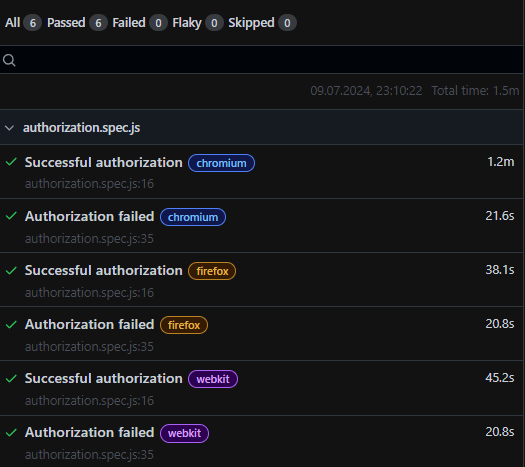

## Задача 2. UI-тест на Playwright  
1. Подготовлены тестовые данные:
   - создан файл `user.js` и добавлен в `.gitignore`
2. Создан тест «Успешная авторизация».
3. Ожидаемый результат получен:
   - открылась страница профиля
4. Создан тест «Неуспешная авторизация».
   - запущен тест с невалидными данными для авторизации

